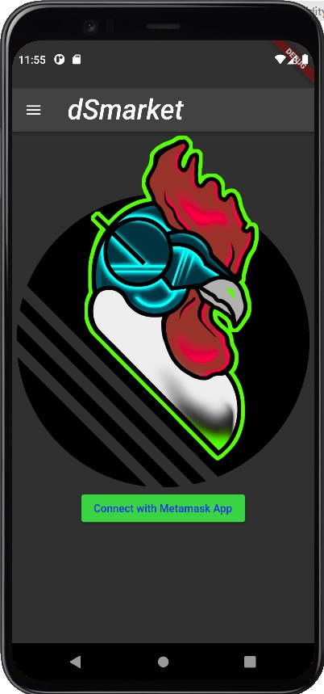

# dSmarket - The Decentralized Smart Contract Market Place: Polygon Blockchain

## Project Description
Defi, NFT Art, and Video games are not inclusive to the greater population in the way that a multi-use, utility blockchain could be. dSmarket aims to allow for people to transact in a human manner, with crypto currencies as a means of value. dSmarket creates an open standard for two parties to decide upon work and compensation for the service or product. The Marketplace contract standard provides a coordinating function for marketplace organizers to insure that the marketplace focuses on what the organizer or organization values.

These standards for market commerce allow for marketplaces to provide either regional, service specific, or organizationally aligned business coordination utilizing the decentralized control of the Ethereum virtual machine. Market places can be monitored and controlled, without baring humans from the entire space. This effectively replaces the backend and central control of companies like Uber, Task Rabbit, or even free services like Craig’s List.

This open standard in service-based labor coordination facilitates democratic processes to flourish and enable inclusion by allowing anonymity in a community-oriented commerce center without compromising the purchasing power of a cryptocurrency. This also provides a means for the cultural shift away from relying on fiat currency to crypto currency.

## Inspiration
Let's be honest. Even with the constant discussion on how blockchain decentralizes control and gives the individual control of their assets, and thus their lives, there are really only 3 different types of dApps that seem to even get created: DeFi, Videogames, or NFT art galleries. The users of these dApps are generally already believers of crypto currency, and have financial resources to fully participate in the #cryptolife or and have the time to understand how a decentralized future would ultimately benefit both sellers and customer. Crypto needs to be inclusive of all financial backgrounds in order to fully take hold. There will be continued resistance, government backlash without this grassroots involvement in the adoption of crypto in leu of cash for goods and services. 

dSmarket aims to eliminate the confusion of crypto, and the financial and technical knowledge barriers that keep people from benefiting from a financial system without central, non-transparent, and often manipulative control. This dApp's concept is not revolutionary. However, the advantages, and implementation of the app in an independant, distributed and decentralized manner truly are. Simply put the dApp is market place infrastructure to coordinate requests for goods or services with service providers through the most beneficial part blockchain technologies: Smart Contracts.

In the words of Vitalik Buterin:
<em>
Whereas most technologies tend to automate workers on the periphery doing menial tasks, blockchains automate away the center. Instead of putting the taxi driver out of a job, blockchain puts Uber out of a job and lets the taxi drivers work with the customer directly.
</em>

With this philosophy in mind, the dSmarketPlace market place allows contractors to select Gigs/Jobs (like traditional gig economy) but for all types of services instead of having to go through a centralized, often non-democratic, corporation that arbatraily takes their cut off the top. The smart contract infrastructure of dSmarket provides tangable, independantly auditable legal agreement between a person requiring work to be performed (a service requestor) and anyone that is able to provide the solution to that work at an acceptable. 

## What it does
For the most up-to-date documentation please look at the [Smart Contracts](contracts/README.md) for the Smart Contract Dicussion, [dApp Documentation](dApp/README.md) for the discussion on the UI/UX.

The app facilitates 4 major components of the ecosystem. 
1. ```A Job MarketPlace```. This managable contract allows for a broker to focus contracts for specific markets, specialized collectives of goods and services, or simply connect people with needs with those that can fulfill them.
2. Profiles and history for both ```Contractors``` (People doing work) and ```Solicitors``` (People Wanting Work). This allows for individuals to audit the hsitory of the contracts of people that they interact with. While the profiles can simply be a wallet, and effectively be a number on a sheet, those anonymous address can have assigned history and quality of work so that people purchase the goods and services based on the repuation of the profile and not simply a name, or having to have high levels of risk for unknown quantities.
3. ```Rating Job Performance and Dispute Reconciliation Support``` by having a self notarizing negotiations and Completion history. The ratings of the jobs go to both the speed at which job solicitors pay their contracts, and how well the contractor completes the services. This effectively, and implicitly build in a reputation to price ratio that helps the best work fetch the best price.
4. Facilitating ```directions to crypto exchanges``` to buy, exchange, or manage your crypto through the MetaMask connector. This marketplace partnership with different exhcanges allow for solicitors to buy crypto to solicit jobs, and for contractors to cash out their crypto for cash (until the future day where this step is made obsolete by governments inflating fiat until it is no longer a viable means of commerce).

[](https://youtu.be/xiPh_9meXNk "What does it do")

### Examples of Jobs supported
Example jobs that are created for this demo are the following:

1. ```Currier Service```: A simple job of taking a package across town. Utilizing the system of Profiles (of both solicitor and contractor via their wallets).
2. ```Unique tasks for people trying to transition career fields```: Allows for job history of individuals to be tracked and also used as a resume builder by individuals who want to work outside of traditional employment paradigms 
3. ```Ratings for non-industry specific work```: Allows for people with parallel backgrounds to perform side job tasks that would otherwise require extensive background or references. Something like "I need a fence painted". Or "Help me walk my Dog". 

However, these types of jobs are not the only ones that could be supported by this infrastructure. Existing companies can minimize their backend costs by switiching the storage and solicitation of services through infrastructure like this. Moreover, people could implicitly benefit from the communication with the contract through their app without requiring everyone to use it (meaning people that don't want to use the app can connect with people using the app thus keeping more people on the app instead of forcing the contractors to leave to a new app in order to perform commerce). 

There are also non-profit groups that could benefit from this app. For example, US Veterans can request services for mental heath support, va loan advice, or other services and those services can be searched by groups that provide those services. And visa-versa. 

I will discuss the monetization aspect of the dApp infrastructure later in the README.

### FAQs: 
1. So then how does the app make money? 
Answer: The smart contract infrastructure creates an independant system where people can have legally enforcable agreements to be made without the need for a centralized broker. However, as stated before, since smart contracts have a knowledge barrier to utilize the infrastucture, companies can fill that market gap by providing one, some, or all of the following services:
* Searching a single, multiple, or all marketplaces that pop up to make sure that the ```contractor is able to find the types of jobs that they are interested in```, qualified for, and fits their lifestyle.
* Sell ```draft verbage``` for those contracts where it takes the "legalease" difficulty of writing contracts out of the contractors time, and the contractor can focus on doing the work.
* ```Manage their gigs``` if the contractor is running multiple at a time.
* Facilitate the acquisition, auditing, and ```management of their crypto``` with partner crypto exchanges. This allows the contractors to view their interactions in terms of cash that they are not locked into keeping in crypto if they don't want to, or easily transfer crypto between tokens. 
2. How would I accept work from a specific contractor?
Answer: Should the need arise to know the contractor face to face, the profile feature of the app allows for "digital identification" to be verified through scanning the qr code. A contractor, when showing up to a house can open his or her app, and have the solicitor scan the app to prove identity. 
3. Does this remove anonymity of blockchain?
Answer: Not really. While I am sure there will oneday be a need to register wallets for tax purposes. There is no reason why a person cannot create multiple profiles. And those profiles can each have their own ratings. For example, the high a rating for a profile contract is, the more likly it is that they stay around and continue to bid jobs under that contract, while if another contractor has a lower score, that score doesn't have to stay with them forever if they improve their skills or craft in general. The major risk will always be on the solicitor on which contractor that they accept. 
4. Does this replace apps that are currently in the same space? 
Answer: No, in fact the opposite. Ultimately, everyone is accessing the same service market. This not only expands their potential business base, but it also lowers their operating costs since the majority of the backend interactions are handled by the decentized system.

## How we built it
I started with some fun brainstorming sessions over Discord with some friends, since I am a full-time, remote worker with hecktic schedules and had to basically play "tag" for any coordination that took place. 

For the actual code and dev, I shopped around a little using the helpful tooling of [xxxxxx]. However, I wanted to use the maximum amount of plugins with VSCode to natively develop the entire project. I am interested in making this a full fledged business, but I know until I get some more than the 60ish hours I put in it, it's not going to pay the bills. This ultimately led to running the remix daemon through VSCode. I got alot of help from Github Co-Pilot, and learned alot about automating builds with Github actions.

For flutter, which I have had very little experience with in doing a project of this scale, I relied heavily on the web4dart library, which is a depricated library, and no real answer on if the library will be used in the future. There are also some example code options using walletconnect but didn't really make the smart contract interactions as easy from what I could tell. I absolutely loved how the same code base could be used out of the box for web, mobile, and desktop applications (Fuscia I am coming for you). I will likely put in some Pull-Requests should I find that I want to keep doing this dev in Flutter or just use the javascript native stuff like Cordova.

I used github projects for the project management aspects, and also used github actions for the down-and-dirty ci/cd that really does need to be redone if this really takes off. I think after I do some more research I'll start putting out regular builds for iOS and Android.

## Challenges we ran into
The biggest challenges I ran into were the spikes in gas prices on the Mumbai test network. There were several times that I had to revert to using ganache as the chain so that I would be able to test functionality. But that definitely made it to where the extreme-programming/tandum-programming that I wanted to use to get some of my buddies spun up to help me basically impossible to manage. We ended up using ```AWS``` to test. However, the Mumbai Faucet was really easy to use and I appreciated that they tried to hold some of the liquidity of the ```TEST-MATIC``` by only allowing a small amount be given to wallet at a time. 

We didn't know the best way to manage the ABI assets for the project. Ultimately we just put them in local storage for speed and simplicity, but we should have leveraged this. Basically, another "I didn't have time" excuse. 

I am also interested in exploring the legal aspects of the app. For example, this application doesn't "handle" the interactions for the contractors (like how Uber facilitates all apsects of the rides). With my paradigm, individuals can transact in a way that has all of the artifacts they could take to court to prove they entered into a legal agreement with someone, without the app ever having to "employ" any of the 3rd party contractors. 

## Accomplishments that we're proud of
We learned alot, I definitely was able to stretch my understanding of both Solidity, Flutter, and the #Cryptolife in general. I explored alot of other contest winners projects, marking concerns, and defi standards. Anything good about this project is definitely because I am standing on the shoulders of giants and the work that they have done. 

Ultimately, having a usable app to accomplish it's set out goal while not compromising the day job, family relationships, or general health was a huge win!

## What we learned
Most people, I know at least, consider blockchain a solution without a problem. The more I dive into the technology, the more I know that I am able to accomplish tasks with trasnparent cost (which is very tiny cost now), and put that code out, not only in a repository, but in a usable state where people can interact directly with it for less than a percentage of a penny.

I learned alot about flutter since it's the new hotness that I want to use more for alot of project ideas I have. 

I learned alot about how CI/CD paradigms will likely need to be adapted to have a "good state" to develop against on development chains. I also learned alot of tricks that I can't wait to tell my interns about as they will learn about web3 technologies to set them up for success in their future careers. 

## What's next for dSmarket
Do more testing, since the app was defo rushed. I think there is a huge market for making crypto more accessable in the daily lives of people who are generally more affected by large fluxuations in market instability. If you want to know the market strategy: hit me up and or look at the slide deck in the ```presentations``` folder of the repo! 


I am also going to do more work with the Portfolio aspect of the application. Use IPFS to house the pictures, receipts, before-and-after artifacts of the job so that job contractors can have a digital "show room of what they have done".

I keep going back and forth between offloading the abi references to IPFS, but I would also like to have stored artifacts that would lead to interactions to take place offline and then register next time that the wallet his some connectivity. This could lead to other fun social solutions to technical problems like the advancements of mesh networks in cities like Baltimore that fill in the gaps where simple services like internet connectivity don't have a firm hold. 

There are a few more interactions in the smart contracs that I would like to flush out and then I can definitely see that becoming the defacto standard of business in a couple of markets. 

Short answer: Big Plans! but you need to pay to play baby I won't give you everything for free lol!

## The Team 
```Smart Contracts```
1. Atilla

```Mobile App```
1. Atilla 
2. Evo

```Video```
1. Sinfathisar

## References
1. [Devpost Submission](https://devpost.com/submit-to/15647-polygon-buidl-it-summer-2022/manage/submissions)
